# DevLens AI Architecture

This document is based on the current repository implementation, not on historical roadmap docs. It is written for study, maintenance, debugging, and interview explanation.

## 1. High-Level System Architecture

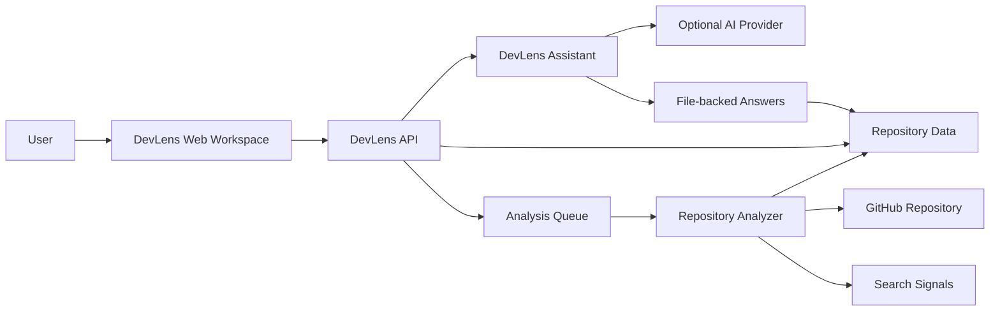

Supporting implementation files:

- `apps/web/app/page.tsx`
- `apps/api/src/modules/repositories/repositories.controller.ts`
- `apps/api/src/modules/repositories/repository-search.controller.ts`
- `apps/api/src/modules/assistant/assistant.controller.ts`
- `apps/api/src/modules/assistant/assistant.service.ts`
- `apps/repository-worker/src/index.ts`
- `packages/shared/src/queue.ts`
- `packages/database/prisma/schema.prisma`

Key point: the active product path is Next web -> Nest API -> Prisma/Postgres plus Redis worker. `apps/ai-service` and `apps/knowledge-worker` exist, but they are not the active V1 assistant or repository-understanding implementation.

## 2. Monorepo Structure Diagram

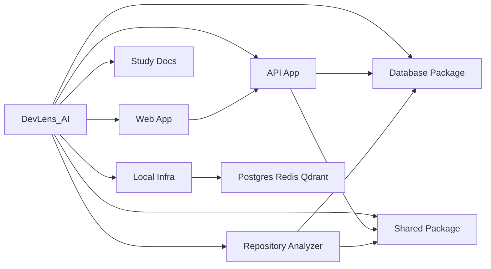

Important folders:

| Folder | Responsibility | Main entry | Communicates with |
| --- | --- | --- | --- |
| `apps/web` | V1 workspace UI, tabs, source preview, assistant panel, citation navigation | `app/page.tsx` | `apps/api` over HTTP |
| `apps/api` | HTTP routes, repository jobs, guide, source, search, assistant | `src/main.ts` | PostgreSQL, Redis, providers |
| `apps/repository-worker` | Clone, scan, parse, save repository analysis | `src/index.ts` | GitHub, PostgreSQL, Redis, Qdrant |
| `apps/knowledge-worker` | Worker boundary scaffold | `src/index.ts` | Not active in V1 flow |
| `apps/ai-service` | FastAPI boundary scaffold | `app/main.py` | Not active in V1 assistant flow |
| `packages/database` | Prisma schema and database client | `prisma/schema.prisma`, `src/index.ts` | API and worker |
| `packages/shared` | Shared types, queue, local vector helper, Qdrant helper | `src/index.ts` | API and worker |
| `infra/docker` | Local containers and ports | `docker-compose.yml` | All local services |

## 3. Repository Analysis Pipeline Diagram

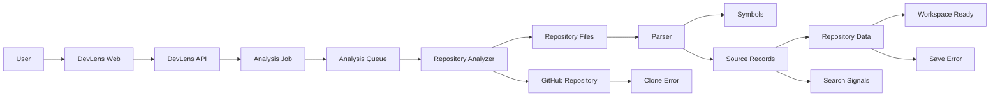

Pipeline stages:

| Stage | Implementation | Input | Output | Persisted result | Failure conditions |
| --- | --- | --- | --- | --- | --- |
| URL submission | `analyzeRepository()` in `apps/web/app/page.tsx` | GitHub URL | POST body | none | API unavailable |
| URL validation | `parseGitHubUrl()` | URL string | owner/name/normalized URL | none | invalid URL |
| Repository record | `RepositoriesController.create()` | parsed URL | `Repository` | `Repository` row | database failure |
| Job record | `RepositoriesController.create()` | repository id | `AnalysisJob` | `AnalysisJob` row | database failure |
| Queue | `RedisQueue.enqueue()` | `CloneJobPayload` | Redis list item | Redis queue item | Redis unavailable |
| Clone | `cloneRepository()` | URL, temp path | local repo folder | temporary files | private/missing repo, network, Git failure |
| File scan | `crawlDirectory()` | temp repo | file entries | not yet | file system errors |
| File caps | `applyV1FileCaps()` | file entries | prioritized V1 file set | not yet | none expected |
| Stack detection | `detectFrameworks()` and extension map | repo files | languages/frameworks | repository fields | malformed manifest |
| Parsing | `extractSymbols()` | JS/TS files | symbols | `Symbol` rows | parser read errors |
| References | `buildSymbolReferences()` | symbols | symbol edges | `SymbolReference` rows | missing symbol ids skipped |
| Source records | `buildKnowledgeChunks()` | files/symbols | chunks | `KnowledgeChunk` rows | very large files skipped |
| Save | Prisma transaction | all analysis data | completed DB state | files/symbols/chunks/repo/job | timeout, DB unavailable |
| Search points | `upsertKnowledgePoints()` | saved chunks | Qdrant points | Qdrant collection | Qdrant failure falls back to lexical search |

Real job states:

- `QUEUED`
- `RUNNING`
- `COMPLETED`
- `FAILED`
- `CANCELLED`

Real worker steps currently used:

- `queued`
- `cloning`
- `indexing_files`
- `detecting_stack`
- `saving_metadata`
- `building_knowledge_index`
- `completed`
- `queue_unavailable` on queue failure

## 4. Repository Analysis Sequence Diagram

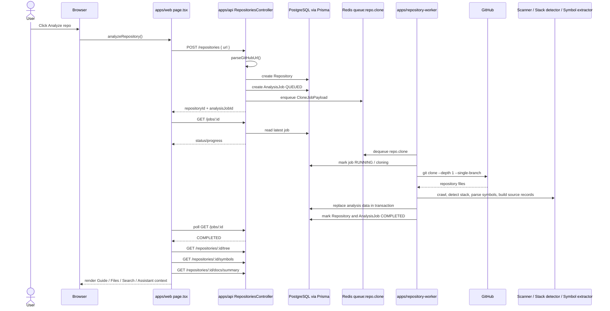

Real endpoints used:

- `POST /repositories`
- `GET /jobs/:id`
- `GET /repositories/:id/tree`
- `GET /repositories/:id/symbols`
- `GET /repositories/:id/docs/summary`
- `POST /repositories/:id/guide/enhance`

## 5. Frontend Architecture Diagram

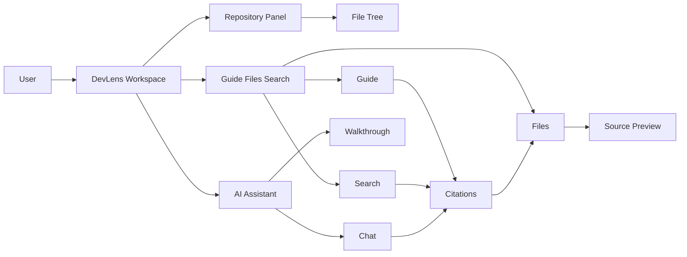

State ownership is centralized in `apps/web/app/page.tsx`. The page component owns repository analysis state, tree state, selected file state, search state, guide state, assistant state, and walkthrough state. Smaller render helpers and builder functions prepare UI data, but there is not yet a separate component hierarchy for each panel.

Important frontend file paths:

- `apps/web/app/page.tsx`: main UI, state, fetch calls, citation navigation.
- `apps/web/app/devlens-icons.tsx`: icon mapping.
- `apps/web/app/globals.css`: global styles and app shell behavior.
- `apps/web/app/layout.tsx`: app metadata and root layout.

## 6. Backend Layer Diagram

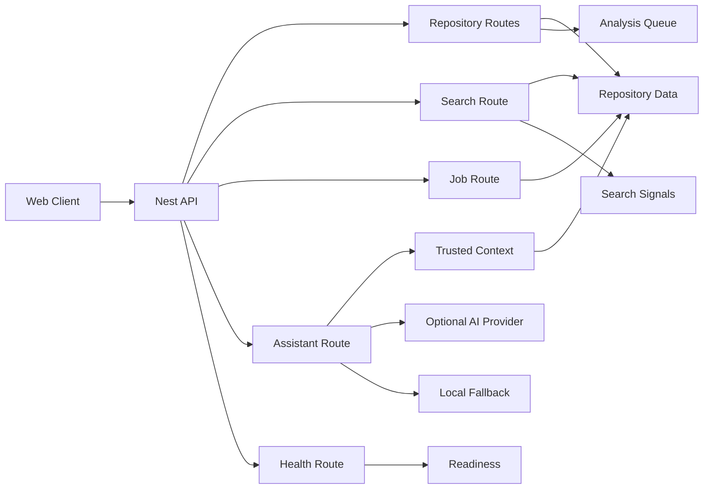

Major feature mapping:

| Feature | Route | File |
| --- | --- | --- |
| Health | `GET /health`, `GET /health/ready` | `apps/api/src/modules/health/health.controller.ts` |
| Repository creation | `POST /repositories` | `apps/api/src/modules/repositories/repositories.controller.ts` |
| Job status | `GET /jobs/:id` | `apps/api/src/modules/jobs/jobs.controller.ts` |
| Tree | `GET /repositories/:id/tree` | `apps/api/src/modules/repositories/repositories.controller.ts` |
| File source | `GET /repositories/:id/files/source` | `apps/api/src/modules/repositories/repositories.controller.ts` |
| Search | `GET /repositories/:repositoryId/search` | `apps/api/src/modules/repositories/repository-search.controller.ts` |
| Symbols | `GET /repositories/:id/symbols` | `apps/api/src/modules/repositories/repositories.controller.ts` |
| Understanding | `GET /repositories/:id/understanding` | `apps/api/src/modules/repositories/repositories.controller.ts` |
| Guide summary | `GET /repositories/:id/docs/summary` | `apps/api/src/modules/repositories/repositories.controller.ts` |
| Guide enhancement | `POST /repositories/:id/guide/enhance` | `apps/api/src/modules/repositories/repositories.controller.ts` |
| Assistant ask | `POST /repositories/:repositoryId/assistant/ask` | `apps/api/src/modules/assistant/assistant.controller.ts` |

## 7. Data Model and Persistence Diagram

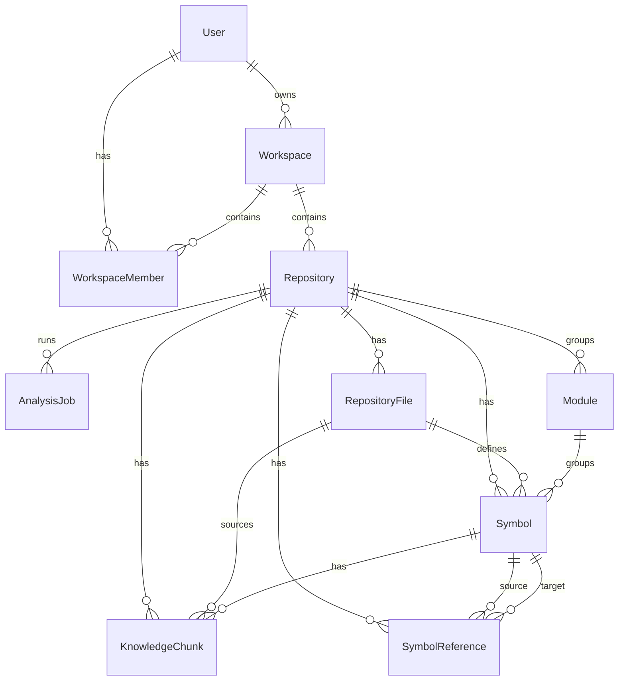

Persisted:

- users, workspaces, workspace memberships
- repositories and analysis status
- analysis jobs and progress
- repository files
- symbols and references
- source/search records in `KnowledgeChunk`

Temporary:

- cloned repositories in `temp/clones/:repositoryId`
- frontend selected file, expanded folders, active tab, assistant messages, walkthrough progress
- provider request IDs and in-flight request map

Recomputed:

- repository understanding from `loadDocsContext()` and `buildRepositoryUnderstanding()`
- guide summary response
- selected-file intelligence
- guided investigation recommendations
- search ranking

Not persisted as tables:

- conversations
- walkthrough progress
- repository-understanding snapshots
- generated guide-enhancement state

Re-analysis behavior:

- worker deletes existing `KnowledgeChunk`, `SymbolReference`, `Symbol`, and `RepositoryFile` rows for the repository before saving fresh analysis results.
- repository row is updated with current languages, frameworks, file count, size, and statuses.

Deletion behavior:

- Prisma relations exist, but explicit cascade deletion policy is not modeled in the current schema. Repository re-analysis uses explicit delete calls in the worker transaction.

## 8. Search Architecture Diagram

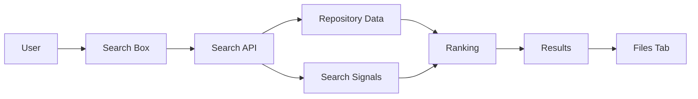

Searchable data:

- `KnowledgeChunk.title`
- `KnowledgeChunk.path`
- `KnowledgeChunk.content`
- `KnowledgeChunk.language`
- symbol metadata joined from `Symbol`
- file metadata joined from `RepositoryFile`

Ranking approach:

- query token parsing with stopwords and aliases
- exact path/title/content hits
- identifier-aware matching
- symbol-name boosts
- usage-intent boosts for call/reference questions
- test-file downweighting
- optional Qdrant score blended into final score

Semantic/vector note:

- The repo has local vector generation in `packages/shared/src/embeddings.ts`.
- Qdrant search is implemented and optional.
- If Qdrant fails, search catches the error and falls back to lexical database search.

Click-to-open behavior is handled in `apps/web/app/page.tsx` by switching to the Files tab and selecting the cited path/result.

## 9. Repository Understanding Architecture

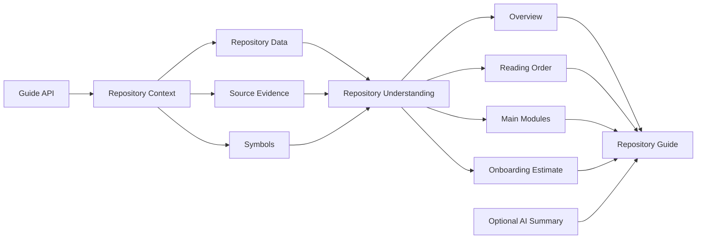

Evidence sources:

- repository name
- README snippets
- `package.json`
- file tree and path conventions
- routes/controllers/services/config/database folders
- symbol names and references
- test file counts
- generated-file counts

Classification:

| Output | Method |
| --- | --- |
| purpose | rule-based/heuristic; optionally improved by provider |
| project type/domain | heuristic |
| technologies | deterministic manifest and extension checks |
| architecture | heuristic path/module interpretation |
| main modules | heuristic folder/path interpretation |
| important files | deterministic path priority rules |
| reading order | deterministic ordered path patterns |
| onboarding estimate | heuristic |
| enhanced guide summary | externally AI-generated only when provider succeeds; otherwise fallback |

## 10. File Intelligence Flow

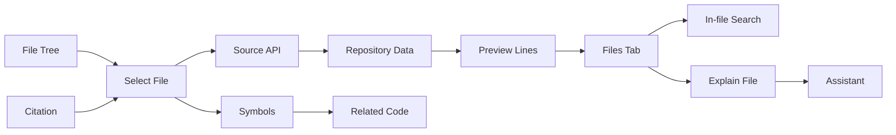

Implementation files:

- Frontend: `apps/web/app/page.tsx`
- File source endpoint: `apps/api/src/modules/repositories/repositories.controller.ts`
- Source records: `KnowledgeChunk` model in `packages/database/prisma/schema.prisma`

The source preview is not read directly from GitHub at selection time. It is reconstructed from saved `KnowledgeChunk` rows.

## 11. DevLens Assistant and Guided Investigation Diagram

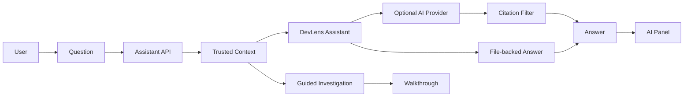

Implemented:

- user questions
- selected repository context
- selected file context
- search-backed context when relevant
- repository-understanding context
- symbols and source snippets
- answer formatting
- citations
- next-step recommendations
- walkthrough progress in frontend state
- provider fallback

Not implemented:

- autonomous file editing
- commits
- pull requests
- visible multi-agent runtime
- persistent autonomous loops
- persisted conversations
- persisted walkthrough progress

External LLM calls are implemented only when provider credentials are configured. Otherwise answers fall back to repository context.

## 12. Citation Navigation Sequence Diagram

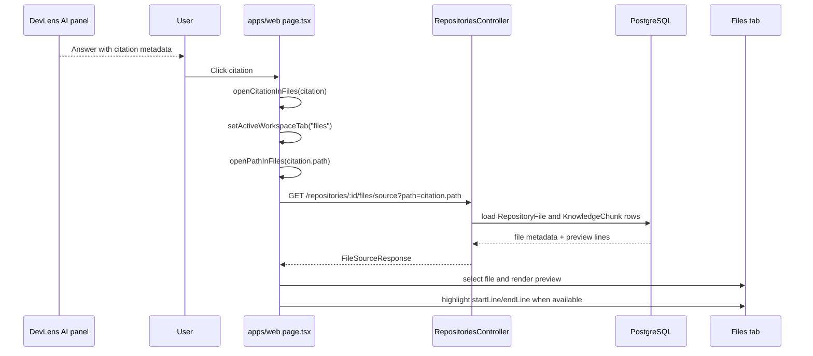

Relevant functions/components:

- `openCitationInFiles()` in `apps/web/app/page.tsx`
- `openPathInFiles()` in `apps/web/app/page.tsx`
- `fileSource()` in `apps/api/src/modules/repositories/repositories.controller.ts`

## 13. Deployment Architecture Diagram

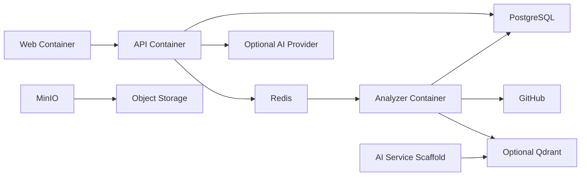

Startup order:

1. PostgreSQL and Redis must be healthy.
2. API can run database setup and start.
3. Web depends on API.
4. Repository worker depends on PostgreSQL and Redis.
5. Qdrant is optional for search enhancement; lexical search remains available.

Ports:

- web: `3000`
- API: `4000`
- PostgreSQL: `55452`
- Redis: `6379`
- Qdrant: `6333`, `6334`
- MinIO: `9000`, `9001`
- AI service scaffold: `8000`

Production deployment is not fully specified in the repo. Docker Compose is the implemented reference environment.

## 14. Security Boundary Diagram

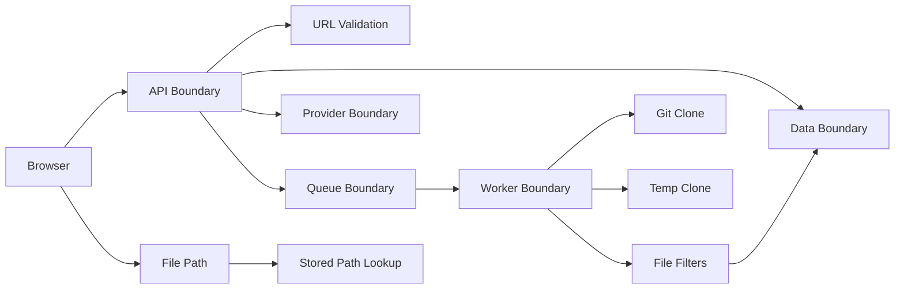

Real protections:

- GitHub URL validation in `parseGitHubUrl()`.
- Git prompts disabled with `GIT_TERMINAL_PROMPT=0`.
- Optional `GITHUB_TOKEN` is backend-only and redacted from clone errors.
- Temporary clone folder is cleared before clone attempts.
- Ignored folders include `.git`, `node_modules`, build outputs, caches, and vendor folders.
- File size limits and chunk size limits are configured.
- Low-value/binary/media patterns are deprioritized or skipped.
- Source file access uses repository id plus stored path lookup rather than arbitrary disk reads.
- Provider keys are read server-side from environment.
- Gemini request logs redact full API key and endpoint key.

Missing or limited protections:

- Full authentication/authorization is not implemented as a polished V1 product.
- Rate limiting is not implemented.
- Production private-repository token storage is not implemented.
- Repository code is read, not executed, but deeper secret scanning is not a complete product feature.

## 15. Failure Flow Diagram

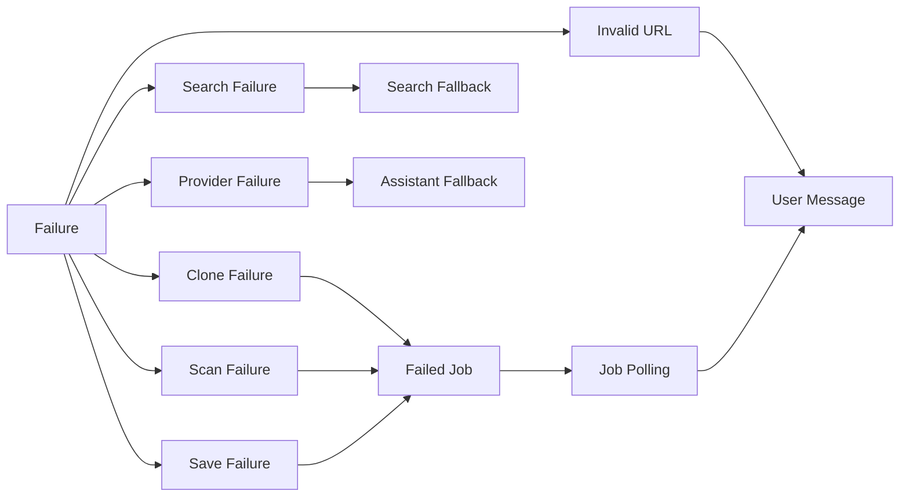

Retry behavior:

- Git clone retries up to two attempts inside `cloneRepository()`.
- Queue `dequeue()` catches worker errors and waits before continuing.
- Gemini retries temporary failures and switches configured models for quota exhaustion.
- Search falls back when Qdrant fails.
- User can retry repository analysis manually from the UI.

## 16. V1 Scope Boundary Diagram

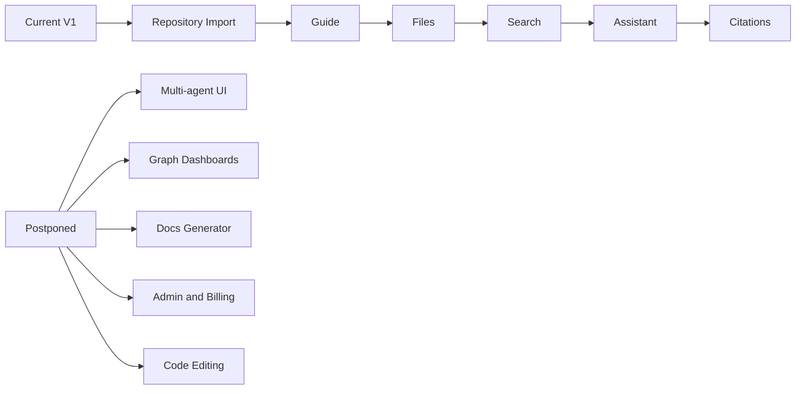

This boundary is intentional. DevLens V1 is a repository-understanding workspace, not a broad developer-platform dashboard.

## 17. Study-First Architecture Summary

### Five Most Important Subsystems

1. Frontend workspace: `apps/web/app/page.tsx`.
2. Repository API: `apps/api/src/modules/repositories/repositories.controller.ts`.
3. Repository worker: `apps/repository-worker/src/index.ts`.
4. Data model: `packages/database/prisma/schema.prisma`.
5. Assistant/search intelligence: `assistant.service.ts` and `repository-search.controller.ts`.

### Ten Most Important Files To Study First

| Path | Responsibility | Why it matters | Understand before moving forward |
| --- | --- | --- | --- |
| `apps/web/app/page.tsx` | Main workspace UI and state | Owns the user experience end to end | React state, fetch calls, tabs, citation navigation |
| `apps/api/src/modules/repositories/repositories.controller.ts` | Repository routes and guide generation | Most API behavior lives here | repository creation, docs summary, file source, symbols |
| `apps/repository-worker/src/index.ts` | Clone and analysis pipeline | Converts a repo into database records | V1 caps, parser, DB transaction, failure handling |
| `packages/database/prisma/schema.prisma` | Database model | Defines persistence truth | entities and relationships |
| `apps/api/src/modules/assistant/assistant.service.ts` | Assistant provider and fallback logic | Keeps answers grounded | citation filtering, provider retry, local fallback |
| `apps/api/src/modules/assistant/assistant.controller.ts` | Assistant HTTP route | Merges trusted server context | `buildStoredAssistantContext()` |
| `apps/api/src/modules/repositories/repository-search.controller.ts` | Search endpoint | Powers Search and assistant lookup | scoring, Qdrant fallback, line metadata |
| `packages/shared/src/queue.ts` | Redis queue abstraction | Connects API to worker | enqueue/dequeue behavior |
| `packages/shared/src/qdrant.ts` | Qdrant helper | Optional vector search integration | collection, upsert, search |
| `infra/docker/docker-compose.yml` | Local runtime | Explains services and ports | startup dependencies |

### Recommended Code-Reading Order

1. `README.md`
2. `docs/ARCHITECTURE_CHEAT_SHEET.md`
3. `packages/database/prisma/schema.prisma`
4. `apps/api/src/modules/repositories/repositories.controller.ts`
5. `apps/repository-worker/src/index.ts`
6. `apps/web/app/page.tsx`
7. `apps/api/src/modules/repositories/repository-search.controller.ts`
8. `apps/api/src/modules/assistant/assistant.service.ts`
9. `infra/docker/docker-compose.yml`
10. tests in `apps/api/src/modules/**/*.spec.ts`

### Three Most Important End-To-End Flows

1. Analyze repository: web form -> API -> Redis -> worker -> database -> UI refresh.
2. Inspect file: file tree -> source endpoint -> source preview -> file intelligence -> assistant context.
3. Ask assistant: prompt -> context pack -> provider/local fallback -> citation filtering -> Files tab navigation.

### Hardest Architecture Decisions

- Keeping answers citation-first while allowing optional provider enhancement.
- Making large repositories usable through prioritization and caps.
- Keeping search useful when Qdrant is unavailable.
- Concentrating V1 product scope instead of exposing every backend scaffold.
- Balancing fast frontend iteration against the large `page.tsx` file.

### Current Limitations

- Authentication and authorization are not production-complete.
- Conversations and walkthrough progress are not persisted.
- Repository understanding is recomputed, not stored as a dedicated table.
- Non-JavaScript/TypeScript symbol extraction is lighter.
- Production deployment is not fully specified.
- Rate limiting is not implemented.

### Likely Interview Questions

- What happens after a user clicks Analyze repo?
- Why is repository analysis asynchronous?
- How does DevLens prevent provider answers from inventing file paths?
- What data powers the Repository Guide?
- How does search rank results?
- How are large repositories handled?
- Which services are active versus scaffolded?
- What would you do first before production deployment?
