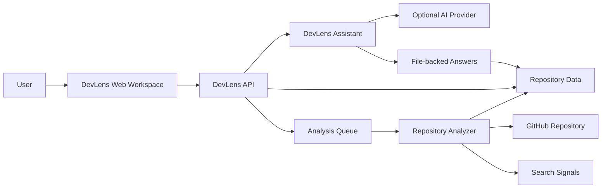

# DevLens AI Architecture Cheat Sheet

DevLens AI is a repository-understanding workspace that analyzes a GitHub repo and helps developers inspect it through a Guide, Files, Search, and one citation-backed assistant.

## Compact Architecture

## Main Applications

- `apps/web`: fixed three-column V1 UI.
- `apps/api`: routes for repositories, jobs, search, source, symbols, assistant, health.
- `apps/repository-worker`: clone, scan, parse, save repository analysis.
- `apps/ai-service`: FastAPI scaffold, not the active V1 assistant path.
- `apps/knowledge-worker`: worker scaffold, not active in the V1 analysis path.

## Main API Groups

- `GET /health`, `GET /health/ready`
- `POST /repositories`
- `GET /jobs/:id`
- `GET /repositories/:id/tree`
- `GET /repositories/:id/files/source`
- `GET /repositories/:id/docs/summary`
- `GET /repositories/:id/understanding`
- `POST /repositories/:id/guide/enhance`
- `GET /repositories/:repositoryId/search`
- `GET /repositories/:id/symbols`
- `POST /repositories/:repositoryId/assistant/ask`

## Main Database Entities

- `User`, `Workspace`, `WorkspaceMember`
- `Repository`
- `AnalysisJob`
- `RepositoryFile`
- `Module`
- `Symbol`
- `SymbolReference`
- `KnowledgeChunk`

## Analysis Pipeline

GitHub URL -> validate URL -> create repository -> create job -> enqueue `repo.clone` -> worker clones repo -> scans files -> detects stack -> extracts symbols/references -> creates source records -> saves to PostgreSQL -> optionally upserts Qdrant -> marks job completed.

## Search Flow

Search query -> `GET /repositories/:repositoryId/search` -> parse terms -> database source-record lookup -> optional Qdrant matches -> lexical/symbol/path scoring -> ranked results -> click result opens Files tab.

## Assistant Flow

Question -> frontend context -> `POST /assistant/ask` -> API loads trusted repository context -> provider if configured -> citation filtering -> local fallback if needed -> answer with clickable citations.

## Citation Flow

Assistant/Search/Guide citation -> `openCitationInFiles()` -> switch to Files tab -> select path -> fetch source preview -> highlight line range when available.

## Security Controls

- GitHub URL shape validation.
- Server-side provider keys only.
- Optional backend-only `GITHUB_TOKEN`.
- Token redaction in clone/provider logs.
- Ignored folders and file-size caps.
- Source preview reads stored database records, not arbitrary disk paths.

## Current Limitations

- Full auth/authorization is not production-complete.
- Conversations and walkthrough progress are client-side.
- No autonomous code editing, commits, or pull requests.
- No visible multi-agent runtime.
- Production deployment is not fully defined beyond Docker Compose.

## Future Extension Path

- Split `apps/web/app/page.tsx` into focused components.
- Add production auth and workspace authorization.
- Improve language parsers beyond JavaScript/TypeScript.
- Add persisted conversations and walkthrough progress.
- Harden private repository token management.
- Add production deployment manifests and observability.
