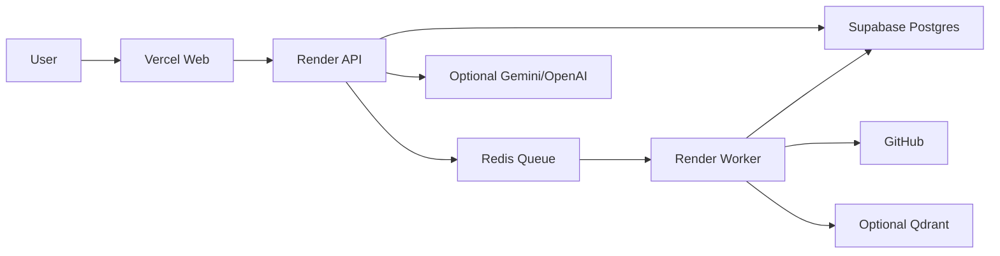

# Deployment

DevLens AI should be deployed as a small distributed system, not as a web-only app.

Recommended first production setup:

- Vercel: Next.js web app.
- Render: NestJS API service.
- Render: repository worker background service.
- Supabase: PostgreSQL database.
- Render Key Value or Upstash: Redis-compatible queue.
- Optional: Gemini/OpenAI provider credentials.
- Optional: Qdrant search service.

## Production Architecture



## Why This Split

Vercel is the best fit for the Next.js frontend. Render is a practical fit for the long-running API and worker processes. Supabase provides managed PostgreSQL without running your own database server. Redis is still required because repository analysis is queued and processed by the worker.

Do not deploy only to Vercel. The web app needs a public API URL, and repository analysis needs a running worker plus Redis.

## Service Setup Order

1. Create Supabase project.
2. Copy the Supabase Postgres connection string.
3. Create Redis using Render Key Value or Upstash.
4. Create Render API service from this repository.
5. Create Render repository worker service from this repository.
6. Create Vercel web project from this repository.
7. Wire final public URLs into environment variables.
8. Run the production smoke test.

## Supabase Postgres

Create a Supabase project and use its Postgres connection string as `DATABASE_URL` for both Render services.

Use a connection string that works from server environments. If Supabase provides both pooled and direct URLs, use the one recommended for long-running server connections. Keep credentials in Render environment variables only.

Initial schema setup:

```bash
npm install
npm run db:generate -w @devlens/database
npm run db:push -w @devlens/database
```

Run this once against the production `DATABASE_URL`. For a later mature release, replace schema push with reviewed migrations.

## Redis

Use one Redis-compatible instance for the API and worker.

Options:

- Render Key Value
- Upstash Redis

Set the same `REDIS_URL` on both Render services.

## Render API Service

You can use `render.yaml` from the repository root, or create the service manually in the Render dashboard.
The included Blueprint defines the API and worker services only; create Supabase Postgres and Redis separately, then paste their URLs into the Render environment variables.

Build command:

```bash
npm install && npm run db:generate -w @devlens/database && npm run build -w @devlens/shared && npm run build -w @devlens/database && npm run build -w @devlens/api
```

Start command:

```bash
npm run start -w @devlens/api
```

Health check path:

```text
/health/ready
```

Required environment variables:

```text
NODE_ENV=production
API_PORT=4000
DATABASE_URL=<Supabase Postgres URL>
REDIS_URL=<Redis URL>
JWT_SECRET=<strong random secret>
WEB_ORIGIN=<Vercel web URL>
```

Provider variables are optional:

```text
AI_PROVIDER=gemini
GEMINI_API_KEY=<Gemini API key>
GEMINI_MODEL_CHAIN=gemini-3.1-flash-lite,gemini-3-flash,gemini-3.5-flash
GEMINI_MAX_ATTEMPTS=3
```

If `GEMINI_API_KEY` is missing, the assistant should fall back to file-backed answers.

## Render Repository Worker

Create this as a Render background worker.

Build command:

```bash
npm install && npm run db:generate -w @devlens/database && npm run build -w @devlens/shared && npm run build -w @devlens/database && npm run build -w @devlens/repository-worker
```

Start command:

```bash
npm run start -w @devlens/repository-worker
```

Required environment variables:

```text
NODE_ENV=production
DATABASE_URL=<same Supabase Postgres URL>
REDIS_URL=<same Redis URL>
```

Optional environment variables:

```text
GITHUB_TOKEN=<token for private repos or higher GitHub limits>
QDRANT_URL=<Qdrant URL, if enabled>
REPOSITORY_V1_MAX_ANALYZED_FILES=1200
REPOSITORY_V1_MAX_SYMBOLS=3000
REPOSITORY_V1_MAX_SOURCE_RECORDS=2500
REPOSITORY_DB_WRITE_BATCH_SIZE=500
REPOSITORY_DB_TRANSACTION_TIMEOUT_MS=60000
```

The worker must stay running. If it sleeps or is stopped, repository analysis can remain queued.

## Vercel Web

Create a Vercel project from this monorepo.

Recommended project settings:

```text
Framework Preset: Next.js
Root Directory: repository root
Install Command: npm install
Build Command: npm run build -w @devlens/shared && npm run build -w @devlens/web
Output Directory: apps/web/.next
```

Required environment variable:

```text
NEXT_PUBLIC_API_URL=<Render API public URL>
```

After Vercel provides the public web URL, set the Render API `WEB_ORIGIN` to that exact URL and redeploy the API.

## Optional Qdrant

Qdrant is optional for the first deployment. If it is not configured, DevLens should continue using repository data and local search behavior.

Only add `QDRANT_URL` after a Qdrant service is available and reachable by the API or worker.

## Production Smoke Test

After all services are deployed:

1. Open the Vercel web URL.
2. Confirm API readiness:

```text
<Render API URL>/health/ready
```

3. Analyze:

```text
https://github.com/Anwar-04/linkforge-url-shortener
```

4. Confirm:
   - analysis completes
   - Guide renders
   - Files renders
   - Search renders
   - README preview lines show
   - assistant answers with citations
   - citations open the Files tab and source lines
   - walkthrough starts only when requested
   - no fake README route/controller suggestions appear

## Common Issues

If analysis stays queued or preparing:

- Confirm the Render worker is running.
- Confirm worker and API use the same `DATABASE_URL`.
- Confirm worker and API use the same `REDIS_URL`.
- Check worker logs for GitHub clone failures.

If the web cannot reach the API:

- Confirm `NEXT_PUBLIC_API_URL` is the public Render API URL.
- Confirm API `WEB_ORIGIN` is the Vercel web URL.
- Redeploy web after changing `NEXT_PUBLIC_API_URL`.
- Redeploy API after changing `WEB_ORIGIN`.

If provider answers are unavailable:

- Confirm `GEMINI_API_KEY` is set on the Render API service.
- Confirm Gemini quota is available.
- Confirm provider failures fall back to file-backed answers.

## Security Notes

- Do not commit `.env` files.
- Do not commit API keys.
- Keep Supabase and Redis credentials in hosting dashboards.
- Do not expose Postgres or Redis credentials to Vercel.
- Only `NEXT_PUBLIC_API_URL` belongs in the Vercel frontend environment.
- Use `GITHUB_TOKEN` only if private repositories or higher GitHub rate limits are required.
