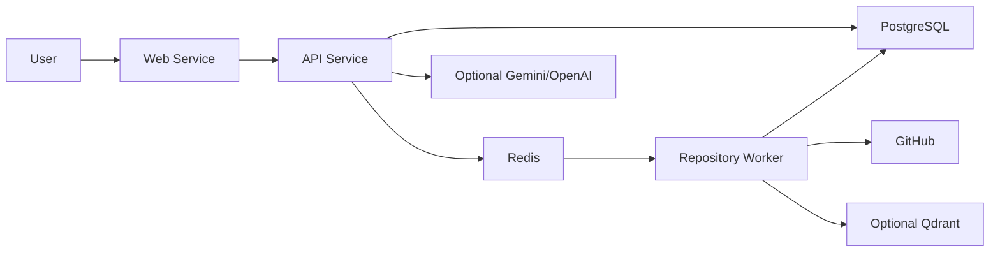

# Deployment

DevLens AI needs more than a static web host. A production deployment must run the web app, API, repository worker, PostgreSQL, Redis, and optional provider/search services.

## Recommended Platform

Use Railway for the first production deployment.

Railway is the best fit for the current codebase because one project can contain the web service, API service, background worker, PostgreSQL, Redis, and optional Qdrant service. Railway services also support internal private networking, which keeps database and Redis traffic away from the public internet.

Render is also viable, especially with a web service plus background worker, Postgres, and Redis-compatible Key Value. Vercel alone is not enough unless the API, worker, database, and Redis are hosted elsewhere.

## Production Architecture



## Required Services

- Web service: `apps/web`, Next.js workspace.
- API service: `apps/api`, NestJS API.
- Repository worker service: `apps/repository-worker`, long-running worker.
- PostgreSQL: canonical repository, file, source, symbol, and job data.
- Redis: repository-analysis job queue.
- Optional Qdrant: search signal storage.
- Optional provider: Gemini or OpenAI for enhanced assistant answers.

## Railway Setup

Create one Railway project with these services:

1. PostgreSQL
2. Redis
3. API
4. Repository Worker
5. Web
6. Optional Qdrant

Use GitHub deploys from this monorepo, or create empty Railway services and deploy from the Railway CLI. Configure each app service with its own build and start commands.

## Environment Variables

### API Service

Required:

```text
NODE_ENV=production
PORT=4000
API_PORT=4000
DATABASE_URL=<Railway Postgres connection string>
REDIS_URL=<Railway Redis connection string>
JWT_SECRET=<strong random secret>
WEB_ORIGIN=<public web URL>
```

Optional:

```text
AI_PROVIDER=gemini
GEMINI_API_KEY=<Gemini API key>
GEMINI_MODEL_CHAIN=gemini-3.1-flash-lite,gemini-3-flash,gemini-3.5-flash
GEMINI_MAX_ATTEMPTS=3
OPENAI_API_KEY=<OpenAI API key, if using OpenAI>
OPENAI_MODEL=gpt-4.1-mini
QDRANT_URL=<Qdrant URL, if enabled>
```

### Repository Worker Service

Required:

```text
NODE_ENV=production
DATABASE_URL=<same Postgres connection string>
REDIS_URL=<same Redis connection string>
```

Optional:

```text
QDRANT_URL=<Qdrant URL, if enabled>
GITHUB_TOKEN=<token for private or higher-rate GitHub access>
REPOSITORY_V1_MAX_ANALYZED_FILES=1200
REPOSITORY_V1_MAX_SYMBOLS=3000
REPOSITORY_V1_MAX_SOURCE_RECORDS=2500
REPOSITORY_DB_WRITE_BATCH_SIZE=500
REPOSITORY_DB_TRANSACTION_TIMEOUT_MS=60000
```

### Web Service

Required:

```text
NODE_ENV=production
NEXT_PUBLIC_API_URL=<public API URL>
```

The browser calls the API directly, so `NEXT_PUBLIC_API_URL` must be a public API URL, not a private internal Railway hostname.

## Build And Start Commands

Run all commands from the repository root.

### API Service

Build:

```bash
npm install
npm run db:generate -w @devlens/database
npm run build -w @devlens/shared
npm run build -w @devlens/database
npm run build -w @devlens/api
```

Start:

```bash
npm run start -w @devlens/api
```

Health check:

```text
/health/ready
```

### Repository Worker Service

Build:

```bash
npm install
npm run db:generate -w @devlens/database
npm run build -w @devlens/shared
npm run build -w @devlens/database
npm run build -w @devlens/repository-worker
```

Start:

```bash
npm run start -w @devlens/repository-worker
```

The worker must stay running. It exits early if required database or Redis configuration is missing.

### Web Service

Build:

```bash
npm install
npm run build -w @devlens/shared
npm run build -w @devlens/web
```

Start:

```bash
npm run start:prod -w @devlens/web
```

## Database Setup

For the first deployment, run schema setup before starting the API or worker:

```bash
npm run db:push -w @devlens/database
```

For a more mature production release, replace schema push with reviewed migrations.

## Release Smoke Test

After deployment:

1. Open the public web URL.
2. Confirm API readiness at `<API_URL>/health/ready`.
3. Analyze:

```text
https://github.com/Anwar-04/linkforge-url-shortener
```

4. Confirm Guide, Files, Search, README preview, assistant citations, and walkthrough still work.
5. Ask the assistant `Explain this repository`.
6. Confirm missing provider credentials fall back cleanly, or configured Gemini/OpenAI answers stay citation-backed.

## Deployment Notes

- Do not commit `.env` files or real provider keys.
- Keep local Windows helper scripts untracked.
- The repository worker needs outbound access to GitHub.
- Private repositories require `GITHUB_TOKEN`.
- If Qdrant is not configured, DevLens should continue using repository data and local search behavior.
- If Gemini/OpenAI is not configured, the assistant should still return file-backed answers.
