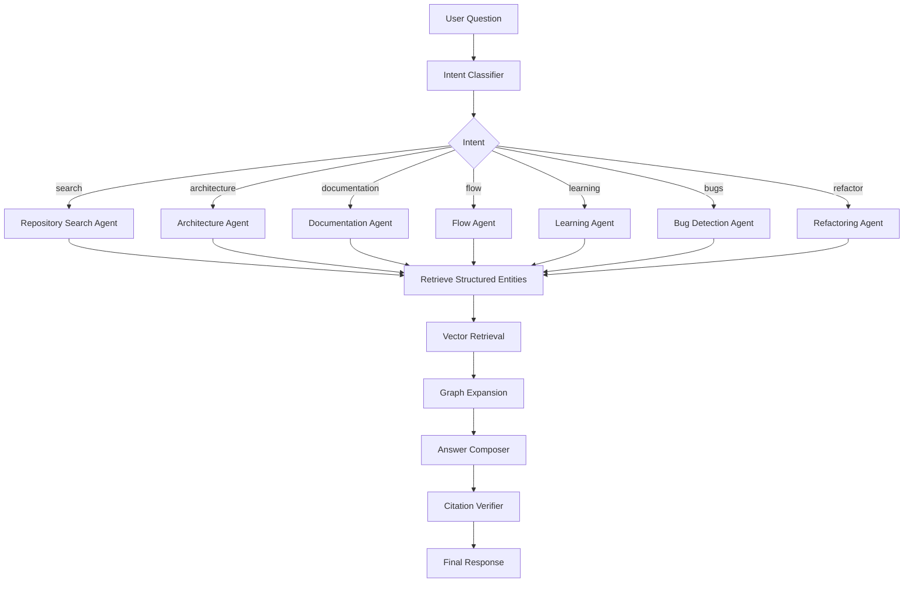
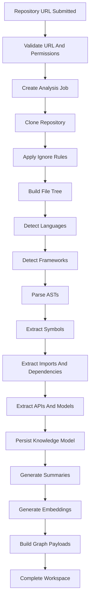

# DevLens AI - AI, RAG, Graph, And Pipeline Design

## 1. AI Agent Architecture

DevLens AI uses specialized agents coordinated through LangGraph. Agents should share tools and repository context but have separate prompts, retrieval strategies, and output contracts.

### Agents

#### Repository Intelligence Agent

Responsibilities:

- Detect languages and frameworks
- Summarize project purpose
- Identify modules and architecture layers
- Build repository overview
- Explain package and config structure

#### Architecture Agent

Responsibilities:

- Explain architecture
- Identify request flows
- Explain authentication flow
- Explain service interactions
- Generate architecture diagrams

#### Documentation Agent

Responsibilities:

- Generate README
- Generate onboarding guide
- Generate module docs
- Generate API docs
- Generate developer handbook

#### Repository Search Agent

Responsibilities:

- Answer location questions
- Search semantically and structurally
- Return source citations
- Rank symbols, files, APIs, and modules

#### Flow Agent

Responsibilities:

- Trace client-to-database paths
- Build sequence diagrams
- Explain middleware/controller/service/repository flow

#### Learning Agent

Responsibilities:

- Explain code by skill level
- Use examples and analogies
- Avoid oversimplifying senior explanations

#### Bug Detection Agent

Responsibilities:

- Detect security issues
- Detect code smells
- Detect dead code
- Detect duplicate patterns
- Highlight risky complexity

#### Refactoring Agent

Responsibilities:

- Suggest SOLID improvements
- Suggest clean architecture boundaries
- Suggest performance and maintainability improvements
- Explain tradeoffs

#### Test Generation Agent

Responsibilities:

- Suggest unit tests
- Suggest integration tests
- Generate mock data plans
- Identify coverage gaps

#### Knowledge Graph Agent

Responsibilities:

- Create and refine relationships between entities
- Generate graph query plans
- Support impact analysis

#### Git Intelligence Agent

Responsibilities:

- Explain commit history
- Identify who changed what
- Summarize related commits
- Link code areas to ownership patterns

## 2. LangGraph Workflow



### Workflow Rules

- Classify intent before retrieval.
- Retrieve structured entities first, vectors second.
- Expand context through graph relationships.
- Compose answer only after source evidence is available.
- Verify citations before returning output.
- If evidence is weak, say what is uncertain.

## 3. RAG Pipeline

### Indexing Pipeline

1. Parse repository.
2. Extract files, folders, symbols, APIs, models, configs, imports, and dependencies.
3. Generate symbol summaries.
4. Generate module summaries.
5. Embed symbols, modules, API endpoints, docs, and selected file sections.
6. Store embeddings in Qdrant with metadata.
7. Store canonical relationships in PostgreSQL.

### Retrieval Pipeline

1. Convert question into retrieval intent.
2. Search PostgreSQL for exact matches: file paths, symbols, APIs, dependencies.
3. Search Qdrant for semantic matches.
4. Expand results through graph relationships.
5. Rank by relevance, relationship proximity, and source confidence.
6. Build context pack with source citations.
7. Generate answer.

### Retrieval Units

Do not rely on arbitrary raw chunks. Use:

- File summaries
- Symbol summaries
- Function/class signatures
- API endpoint records
- Database model records
- Dependency edges
- Module summaries
- Config summaries
- Documentation sections

Raw code snippets may be included only as cited evidence.

## 4. Knowledge Graph Design

### Node Types

- Project
- Folder
- File
- Module
- Class
- Function
- Method
- Interface
- Type
- Component
- API Endpoint
- Database Model
- Config
- External Service
- Package Dependency
- Commit
- Contributor
- Document

### Edge Types

- CONTAINS
- DEFINES
- IMPORTS
- CALLS
- EXTENDS
- IMPLEMENTS
- HANDLES
- READS_FROM
- WRITES_TO
- CONFIGURES
- USES_SERVICE
- DEPENDS_ON
- CHANGED_BY
- DOCUMENTED_BY
- TESTED_BY

### Storage Strategy

MVP stores graph edges in PostgreSQL tables and exposes graph-shaped API responses. Later versions can add Neo4j or Apache AGE if graph traversal becomes a bottleneck.

## 5. Repository Parsing Pipeline



### Parser Strategy

- TypeScript/JavaScript: ts-morph and tree-sitter
- Python: tree-sitter-python and Python AST tooling
- Framework detection: package manifests, config files, directory conventions, and imports
- API extraction: framework-specific adapters
- Database extraction: ORM-specific adapters

## 6. Queue Architecture

### MVP Queues

- `repo.clone`
- `repo.parse`
- `repo.extract`
- `knowledge.summarize`
- `knowledge.embed`
- `knowledge.graph`
- `docs.generate`
- `agents.run`

### Event Contract

```json
{
  "eventId": "uuid",
  "eventType": "repo.analysis.started",
  "repositoryId": "uuid",
  "analysisJobId": "uuid",
  "attempt": 1,
  "occurredAt": "2026-06-27T00:00:00Z",
  "payload": {}
}
```

### Job Design

- Jobs must be idempotent.
- Jobs must support retries with backoff.
- Jobs must update `analysis_jobs.current_step`.
- Jobs must avoid duplicate embeddings for unchanged hashes.
- Jobs must emit audit and telemetry events.

## 7. Security For AI And Repositories

- Treat repository content as untrusted data.
- Do not execute repository code.
- Strip secrets from prompts when detected.
- Prevent prompt injection from repository text.
- Use source-grounded answers only.
- Keep private repo tokens encrypted.
- Use short-lived GitHub tokens where possible.
- Do not log source code unnecessarily.

