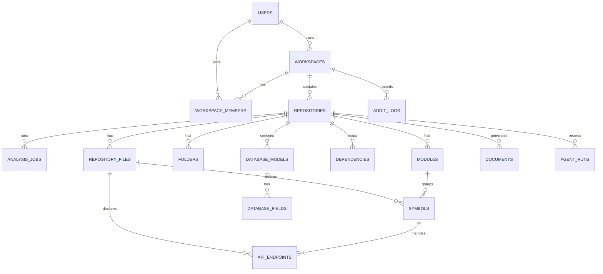

# DevLens AI - Data Model And API Specification

## 1. Database Schema

PostgreSQL is the source of truth. Qdrant stores embeddings. Redis stores transient job and cache state.

### Core Tables

#### users

- `id` UUID primary key
- `email` text unique
- `name` text
- `avatar_url` text
- `github_user_id` text unique
- `role` enum: `USER`, `ADMIN`
- `created_at` timestamp
- `updated_at` timestamp

#### workspaces

- `id` UUID primary key
- `name` text
- `slug` text unique
- `owner_user_id` UUID foreign key
- `created_at` timestamp
- `updated_at` timestamp

#### workspace_members

- `id` UUID primary key
- `workspace_id` UUID foreign key
- `user_id` UUID foreign key
- `role` enum: `OWNER`, `ADMIN`, `MEMBER`, `VIEWER`
- `created_at` timestamp

#### repositories

- `id` UUID primary key
- `workspace_id` UUID foreign key
- `provider` enum: `GITHUB`
- `owner` text
- `name` text
- `url` text
- `default_branch` text
- `visibility` enum: `PUBLIC`, `PRIVATE`
- `clone_status` enum: `PENDING`, `CLONING`, `CLONED`, `FAILED`
- `analysis_status` enum: `PENDING`, `RUNNING`, `COMPLETED`, `FAILED`
- `last_analyzed_commit` text
- `created_by_user_id` UUID foreign key
- `created_at` timestamp
- `updated_at` timestamp

#### analysis_jobs

- `id` UUID primary key
- `repository_id` UUID foreign key
- `status` enum: `QUEUED`, `RUNNING`, `COMPLETED`, `FAILED`, `CANCELLED`
- `current_step` text
- `progress` integer
- `error_message` text nullable
- `started_at` timestamp nullable
- `finished_at` timestamp nullable
- `created_at` timestamp

#### repository_files

- `id` UUID primary key
- `repository_id` UUID foreign key
- `path` text
- `language` text nullable
- `size_bytes` integer
- `hash` text
- `is_generated` boolean
- `is_test` boolean
- `created_at` timestamp

#### folders

- `id` UUID primary key
- `repository_id` UUID foreign key
- `parent_folder_id` UUID nullable
- `path` text
- `name` text

#### modules

- `id` UUID primary key
- `repository_id` UUID foreign key
- `folder_id` UUID nullable
- `name` text
- `path` text
- `layer` enum nullable: `UI`, `API`, `DOMAIN`, `SERVICE`, `DATA`, `CONFIG`, `TEST`, `UNKNOWN`
- `summary` text nullable

#### symbols

- `id` UUID primary key
- `repository_id` UUID foreign key
- `file_id` UUID foreign key
- `module_id` UUID nullable
- `name` text
- `kind` enum: `CLASS`, `FUNCTION`, `METHOD`, `INTERFACE`, `TYPE`, `CONSTANT`, `VARIABLE`, `COMPONENT`, `MODEL`
- `start_line` integer
- `end_line` integer
- `signature` text nullable
- `visibility` text nullable
- `summary` text nullable

#### dependencies

- `id` UUID primary key
- `repository_id` UUID foreign key
- `source_file_id` UUID foreign key
- `target_file_id` UUID nullable
- `source_symbol_id` UUID nullable
- `target_symbol_id` UUID nullable
- `import_path` text
- `dependency_type` enum: `IMPORT`, `CALL`, `EXTENDS`, `IMPLEMENTS`, `USES`, `CONFIGURES`
- `is_external` boolean

#### api_endpoints

- `id` UUID primary key
- `repository_id` UUID foreign key
- `file_id` UUID foreign key
- `method` text
- `path` text
- `framework` text
- `handler_symbol_id` UUID nullable
- `auth_required` boolean nullable
- `summary` text nullable

#### database_models

- `id` UUID primary key
- `repository_id` UUID foreign key
- `file_id` UUID nullable
- `name` text
- `orm` text nullable
- `table_name` text nullable
- `summary` text nullable

#### database_fields

- `id` UUID primary key
- `model_id` UUID foreign key
- `name` text
- `type` text
- `is_primary_key` boolean
- `is_nullable` boolean
- `is_unique` boolean

#### documents

- `id` UUID primary key
- `repository_id` UUID foreign key
- `kind` enum: `README`, `ONBOARDING`, `API_DOCS`, `ARCHITECTURE`, `MODULE_DOC`
- `title` text
- `content_markdown` text
- `created_by` enum: `SYSTEM`, `USER`
- `created_at` timestamp
- `updated_at` timestamp

#### agent_runs

- `id` UUID primary key
- `repository_id` UUID foreign key
- `user_id` UUID foreign key
- `agent_type` text
- `input` jsonb
- `output` jsonb
- `status` enum: `RUNNING`, `COMPLETED`, `FAILED`
- `created_at` timestamp
- `finished_at` timestamp nullable

#### audit_logs

- `id` UUID primary key
- `workspace_id` UUID foreign key
- `user_id` UUID nullable
- `action` text
- `resource_type` text
- `resource_id` text
- `metadata` jsonb
- `created_at` timestamp

## 2. ER Diagram



## 3. API Documentation

### Auth

#### `GET /auth/github`

Starts GitHub OAuth.

#### `GET /auth/github/callback`

Handles GitHub OAuth callback and creates session.

#### `GET /auth/me`

Returns current user and workspace memberships.

### Repositories

#### `POST /repositories`

Creates a repository analysis request.

Request:

```json
{
  "workspaceId": "uuid",
  "url": "https://github.com/org/repo"
}
```

Response:

```json
{
  "repositoryId": "uuid",
  "analysisJobId": "uuid",
  "status": "QUEUED"
}
```

#### `GET /repositories/:id`

Returns repository metadata and analysis status.

#### `GET /repositories/:id/tree`

Returns folder and file tree.

#### `GET /repositories/:id/overview`

Returns languages, frameworks, module summaries, health score, and architecture summary.

#### `GET /repositories/:id/dependencies`

Returns graph nodes and edges for frontend visualization.

### Search

#### `POST /repositories/:id/search`

Semantic and structured search.

Request:

```json
{
  "query": "Where is JWT verified?",
  "mode": "semantic",
  "filters": {
    "language": "typescript"
  }
}
```

### Ask Repository

#### `POST /repositories/:id/ask`

Runs agentic RAG against repository knowledge.

Request:

```json
{
  "question": "Explain the checkout flow",
  "level": "intermediate"
}
```

Response:

```json
{
  "answer": "Markdown answer",
  "citations": [
    {
      "filePath": "src/api/checkout.ts",
      "startLine": 12,
      "endLine": 64
    }
  ],
  "agentRunId": "uuid"
}
```

### Documentation

#### `POST /repositories/:id/documents`

Generates documentation.

Request:

```json
{
  "kind": "ONBOARDING",
  "audience": "new engineer"
}
```

#### `GET /repositories/:id/documents`

Lists generated documents.

### Jobs

#### `GET /jobs/:id`

Returns job status, current step, progress, and errors.

## 4. API Best Practices

- Every response should include stable IDs.
- Long-running operations must return job IDs.
- Never block HTTP requests on repository analysis.
- Validate repository URLs server-side.
- Use cursor pagination for large lists.
- Use explicit authorization checks on every repository route.
- Include citations in AI responses.
- Keep agent run records for auditability.

